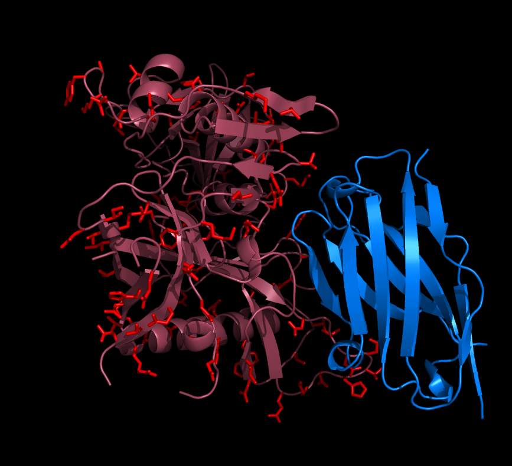

# vHIV
An HIV vaccine molecule. This version shows more clearly the symmetry between creating a glycosylated HIV neutralizing molecule (see aequorea/zHIV) and using designed-in glycans to create an epitope focused vaccine.

  

  vHIV (raspberry and red) shown bound to the N6 heavy chain fragment (blue)

  Potential glycosylation sites selected by gly21 software on the gp120 monomer are shown in red.

  (based on 5TE4.PDB -- DOI:10.1016/j.immuni.2016.10.027)

There may be more to making a vaccine that would encourage broadly neutralizing antibodies like N6 to arise than making a single type of vaccine molecule and doing a single vaccination. There is significant "affinity maturation" of the binding site and a significant number of mutations must occur for broadly neutralizing antibodies to arise. Since HIV itself has been seen to evolve broadly neutralizing antibodies that one might like to see as a response to an infection after immunization, one way to develop an immunization strategy that would result in these kinds of antibodies is to use HIV's behavior in the course of an infection as a model for the strategy.

One HIV behavior is that HIV early entrants, or "pioneers," have statistically fewer N-linked glycosylation sites and may have fewer glycans than HIV viruses that have been part of an infection for a while. To imitate this behavior we might like to see immunization as a series of vaccine molecules which starts with fewer glycans and a more accessible CD4 binding site and progresses to more glycans and a less accessible CD4 binding site. 

Another HIV behavior is that HIV varies the protein surface in areas that neighbor the CD4 binding site while leaving the binding site itself relatively constant. Since it is difficult to evolve an improved affinity to protein that is changing, it may also be important in the series of vaccine molecules to vary the protein surface in the vicinity of the desired binding site to better focus the antibody on it. Of course the natural unavoidable variation of the glycan pattern may also serve to assist in the focusing, but variation of the position of glycans by design to better approximate the shape of the binding site may also be desireable.

Based on the behavior of HIV itself, we have a method of vaccine design that uses glycodesign based epitope focusing with variational sharpening. Use glycans to provide the "broad strokes" for focusing on the region of interest, and use variation of the protein surface in the immediate vicinity of the region to more sharply focus the antibodies on it.

How many different molecules might we need and how long might this kind of immunization series take? In HIV patients, broadly neutralizing antibodies can take years to appear. So maybe vaccine molecules need to be in circulation for a comparable period of time. When I was younger I had allergies. I went to the doctor once a week for a couple of years to get an injection. Maybe HIV immunization turns out to be like that. Maybe it takes 104 different molecules that could be administered once a week for a couple of years. In any case, if we target HIV's CD4 binding site, it seems unlikely to me that a single injection of a single molecule type will get us where we want to be.

